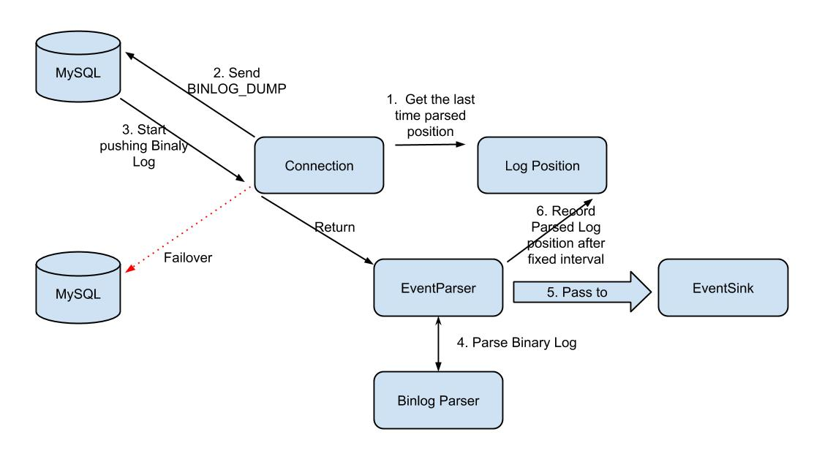
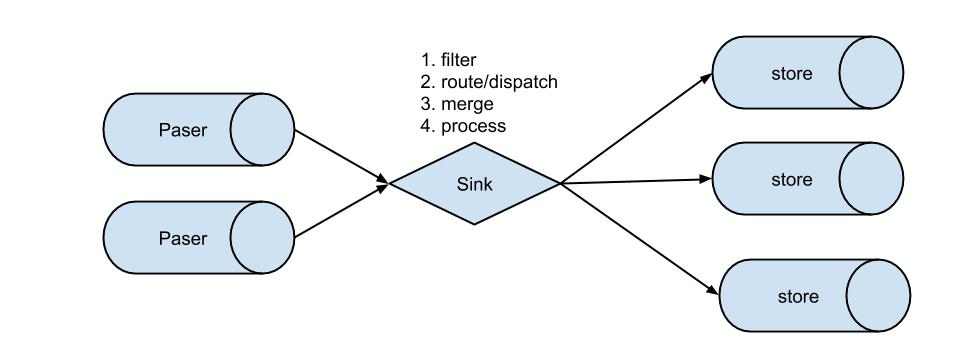
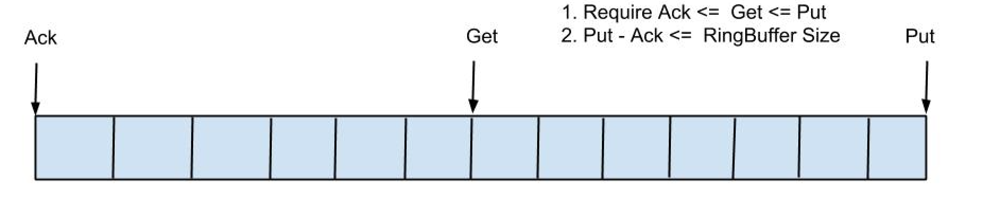
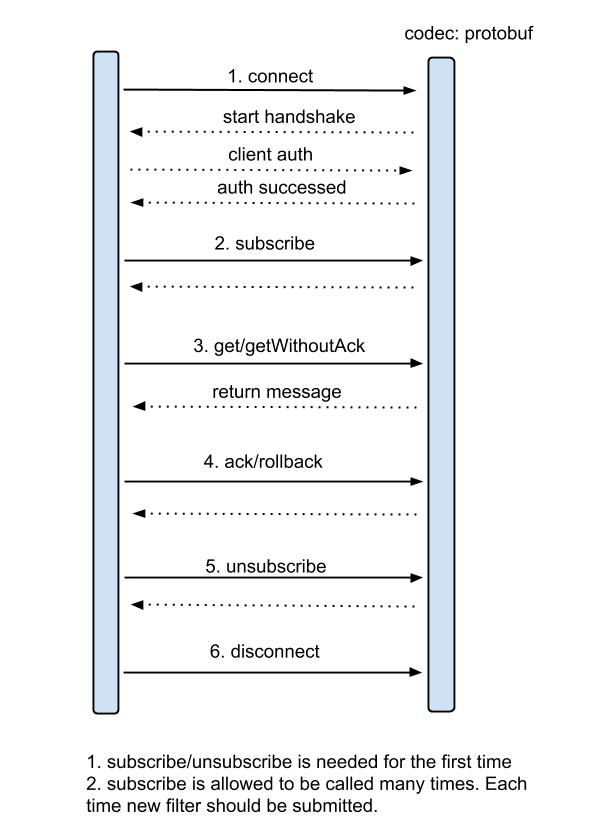
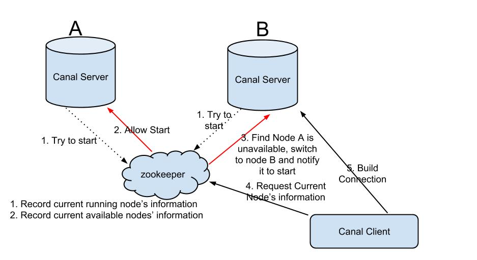

# Developer Guide

## Canal Architecture


Note:

- Server represents a canal server and corresponds to a JVM

- Each instance corresponds to one data queue (1 server may corespond to 1..n instances)

- Instance module:

  - EventParser (Access to the source data, simulating slave protocol to interact with master, protocol analysis)
  - EventSink (EventParser and EventStore Linker for data filtering, processing and dispatch)
  - EventStore (Data storage)
  - MetaManager (Incremental Subscription & consumption meta-info Manager)

  

## EventParser Design



The whole parser process can be roughly divided into several steps:

1. Connection gets the location where the last parsing was successful (if it is started for the first time, it gets the initial specified location or binlog site of the current database)
2. Connection establishes a link and sends a BINLOG_DUMP command
   // 0. write command number
   // 1. write 4 bytes bin-log position to start at
   // 2. write 2 bytes bin-log flags
   // 3. write 4 bytes server id of the slave
   // 4. write bin-log file name
3. MySQL Starts Pushing Binaly Log
4. The received Binaly Log is analyzed by Binlog parser to parse some specific information, including field name, field type, primary key information, and unsigned type processing.
5. Transfer to the EventSink module for data storage, which is a blocking operation until it is successfully saved.
6. After saving the parsed data, the Binaly Log position is recorded regularly.


### MySQL's Binlay Log network protocol


- The 4 byte header of the protocol in the figure mainly describes the length of the entire binlog network packet.

- Refer here for more information about binlog event structure:

  https://dev.mysql.com/doc/internals/en/binary-log.html

  https://dev.mysql.com/doc/internals/en/event-structure.html

  https://dev.mysql.com/doc/internals/en/binlog-event.html

  

## EventSink Design



- Data filtering: support wildcard matching in table name, column name, etc.
- Date route/dispatch: 1 parser to n store destination
- Data merge: n parser to 1 store destinationm
- Data process: Additional process before store stage, e.g. table join.


### Data to Destination is 1:n 

In order to make full use of database resources, common services are generally isolated by schema, and then a data source routing is carried out on MySQL upper layer or DAO (data access object) layer to ignore the influence of the physical location of the database on development. Alibaba Group mainly solves the data source routing problem through cobar/tddl.

Therefore, generally on a database instance, multiple schemas will be deployed, and each schema corresponds to mutiple services.

### Data to Destination is n:1

Similarly, when the data scale of a service reaches a certain magnitude, it will inevitably involve data horizontal splitting and vertical splitting. When processing these splitted data, multiple stores will need to be linked for processing, and the consumption position of binlog will become multiple, and the progress of data consumption cannot be guaranteed as orderly as possible.

Therefore, in certain scenarios, it is necessary to merge the splitted incremental data, such as sorting and merging according to timestamp/global id.

 

## EventStore Design

1. Currently, only the Memory mode has been implemented. Subsequent plans include adding local file storage mode and mixed storage mode.
2. Basically follow [Disruptor](https://github.com/LMAX-Exchange/disruptor)'s RingBuffer ideas


Below is how RingBuffer is designed:


3 cursurs are defined as follows:

- Put: the last write position of Sink module when saving data
- Get: the last extraction location obtained by data subscription
- Ack: the Last Consumption Location for Successful Data Consumption

Referring to the implementation of RingBuffer by dismemberor, flatten the RingBuffer to see:



More details:

- Put/Get/Ack cursor is used to increment and uses long storage.
- Buffer's get operation takes the remainder or the AND operation.  (AND operation: cusor & (size-1). Here size needs to be power of 2 to achieve high efficiency.)


## Instance Design


- Each instance represents an actual running data queue, including components such as EventPaser, EventSink, EventStore, etc.
- The CanalInstanceGenerator is abstracted to provide an interface to different configuration modes:
  - Manager mode: provide interface with your own internal web console/manager system. (Currently, it is mainly used within the Alibaba company)
  - Spring Method: Use Spring xml+properties to build Spring configuration.


## Server Design


The server represents a running instance of Canal. To facilitate componentization, two implementations of Embedded (Embedded) and Netty (Network Access) are particularly abstracted.

- Embedded: Both latency and Availability are required to be relatively high, and they can deal with distributed related issues (such as failover).
- Netty: Based on Netty's encapsulation of a layer of network protocol, Canal server guarantees its availability. It is a Pull model, and there is a slight discount for latency, but this also depends on the situation. (Alibaba's Notify and Metaq, the typical Push/Pull model, are also gradually moving closer to the Pull model at present. Push models have some problems when the data volume is large.)

## Increment Subscription/Compusumption Design



For the specific protocol format, please refer to: [CanalProtocol.proto](https://github.com/alibaba/canal/blob/master/protocol/src/main/java/com/alibaba/otter/canal/protocol/CanalProtocol.proto)

### Introduction to get/ack/rollback protocol:

- `Message GetWithOutack (int batchSize)`  which allows specifying Batch Size. Multiple messages can be obtained at one time. The object returned each time is `Message` object and contains the following contents:
  - A. batch id unique identifier
  - B. specific entries data object, corresponding data object format: [EntryProtocol.proto](https://github.com/alibaba/canal/blob/master/protocol/src/main/java/com/alibaba/otter/canal/protocol/EntryProtocol.proto)
- `Void rollback(long batchId)`, as the name suggests, rolls back the last `get` request and re-acquires the data. Submit based on batch id obtained by `get`.
- `Void ack(long batchId)`, as the name suggests, confirms that the consumption has been successful and notified the server to delete the data. Submit based on batch id obtained by `get` .

Canal's get/ack/rollback protocols are different from the conventional JMS (Java Message Service) protocol. It allows get/ack to be processed asynchronously. For example, `get` can be called several times in succession, and subsequent `ack`/`rollback` can be submitted asynchronously and sequentially, which is thus called streaming api in the project.

### Why Streaming API

- get/ack is asynchronous to reduce network delay and computational cost caused by ack (99% of the states are normal, abnormal rollback belongs to individual cases, and there is no need to sacrifice the entire performance for a individual case)
- After `get` obtains data, there might a bottleneck in downstream consumption service, or multi-process/multi-thread consumption is required. In this case,  `get` can be continuously polled to acquire data and tasks can be continuously sent back to improve parallelization. (A case in the author's real experience: application data consumption needs to cross the China-US network, so one operation is basically over 200 ms. In order to reduce delay, parallelization is required.)

### How Streaming API is Designed


- Each `get` operation generates a mark in the metadata, and the mark is incremented to ensure its uniqueness while running.
- Every `get` operation continues to fetch the cursor recorded in the previous mark operation. If the mark does not exist, the cursor will continue to fetch in the last ack.
- When `ack` is performed, several `ack` sequences are required in the order of mark, and `ack` cannot be skipped. `ack` will delete the current mark and update the corresponding mark position to last `ack` cursor.
- Once an abnormal situation occurs, the client can initiate a rollback situation and reset it: delete all mark, clean up the location of `get` requests, and the next request will continue to be retrieved from last `ack` cursor.

### Entry Data Object: [EntryProtocol.proto](https://github.com/alibaba/canal/blob/master/protocol/src/main/java/com/alibaba/otter/canal/protocol/EntryProtocol.proto)

> Entry
> 	Header
> 		logfileName [binlog filename]
> 		logfileOffset [binlog position]
> 		executeTime [binlog event timestamp]
> 		schemaName [database instance]
> 		tableName [table name]
> 		eventType [insert/update/delete type]
> 	entryType 	[transaction BEGIN/transaction END/data ROWDATA]
> 	storeValue	[byte data,corresponds to RowChange]
> RowChange
> isDdl		[whether it is a ddl operation, e.g., create table/drop table]
> sql		   [Speific ddl sql]
> rowDatas	 [Specific insert/update/delete change, one binlog event may correspond to multiple rows of data change, e.g., batch insert/update/delete]
> beforeColumns [Column type array]
> afterColumns [Column type array]
>
> Column
> index		[column seqeunce number]
> sqlType		[jdbc type]
> name		[column name]
> isKey		[whether is primary key]
> updated		[whether is updated]
> isNull		[whether value is null]
> value		[specific data]

Description:

- Can provide the contents of fields before and after database changes, and information such as name, isKey that are not found in binlog can be supplemented.
- Can provide ddl change statements.

## High Availability (HA) Design

Both canal server and canal client has implemented HA machanism:

- Canal Server: In order to reduce requests for MySQL dump, instances on different servers require that only one server be running and the others be in standby state at the same time.
- Canal client: In order to ensure order, only one canal client instance can perform get/ack/rollback operation at the same time. Otherwise, the client reception cannot ensure order.

The control of the whole HA mechanism mainly relies on several features of ZooKeeper, watcher and EPHEMERAL nodes (bound to session Life cycle).



Steps:

1. Whenever Canal Server tries to start a canal instance, it first requests to ZooKeeper. (implementation: whoever succeeds to create the EPHEMERAL node will be allowed to start it)
2. After the ZooKeeper node is successfully created, the corresponding canal server will start the corresponding canal instance, and the canal instances that were not successfully created will be in the standby state.
3. Once ZooKeeper finds out that the node created by Canal Server A disappears, it will immediately notify other Canal Servers to perform the operation of Step 1 again and reselect a canal server to start the instance.
4. Every time Canal Client connects, it will first ask ZooKeeper who currently started Canal instance and then establish a connection with it. Once the link is unavailable, it will try to connect again.

The Canal Client is similar to the canal server in that it uses ZooKeeper's preemptive method to control the EPHEMERAL node.

## Appendix: About Binlog

MySQL Binary Log Introduction:

- <http://dev.mysql.com/doc/refman/5.5/en/binary-log.html>
- <http://www.taobaodba.com/html/474_mysqls-binary-log_details.html>

To put it simply:

- MySQL's binlog is a multi-file storage. A LogEvent can be located through binlog filename + binlog position.
- MySQL's binlog data format is mainly divided into: statement-based, row-based and mixed based on your own configuration.

```
mysql> show variables like 'binlog_format';
+---------------+-------+
| Variable_name | Value |
+---------------+-------+
| binlog_format | ROW   |
+---------------+-------+
1 row in set (0.00 sec)
```

At present, Canal supports incremental subscription of all modes. But when synchronizing, since statement mode has only SQL without data, and the original change log cannot be obtained, ROW mode is generally recommended.

