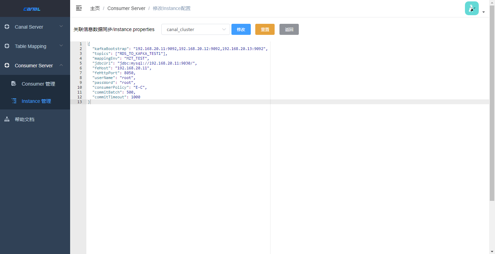

# 背景

需要将mysql是数据实时同步到kafka。


# 设计理念
新增一个Consumer-Server，通过页面配置将数据从kafka导入StarRocks。

## 变化点
1. 新增Consumer-Server功能，其包括 Consumer管理 和 Instance管理 功能。  
 - Consumer管理：用于管理消费者应用程序。
 - Instance管理：用于管理消费topic的实例。

## 功能介绍
1. Consumer管理
   
2. Instance管理
  


## 详细配置说明

1.Consumer管理  
部署打包之后的canal.kafka-to-starrocks-1.1.8-SNAPSHOT.tar.gz服务，即可自动注册到admin中。  
#### 其配置文件说明如下：   
```properties
server.port = 10002 # 端口号
spring.jackson.date-format = yyyy-MM-dd HH:mm:ss
spring.jackson.time-zone = GMT+8
logging.file.path=/opt/k2s/logs/ # 日志的存储位置

# register ip
canal.register.ip =

# canal admin config
canal.admin.manager = 127.0.0.1:8089
canal.admin.port = 11110
canal.admin.user = admin
canal.admin.passwd =123456
# admin auto register
canal.admin.register.auto = true
canal.admin.register.cluster =
canal.admin.register.name =

# forest日志配置
forest.logEnabled=true 
forest.log-request=false
forest.log-response-status=false
forest.log-response-content=false
```
#### 启动方式
```properties
cd /bin
sh startup.sh
```

2. Instance管理
Instance实例配置消费TOPIC的消费者信息，配置之后，手动启动即可开始数据消费。
#### 配置说明如下：
| 属性             | 说明                                                                                                                                                                     |
|----------------|------------------------------------------------------------------------------------------------------------------------------------------------------------------------|
| kafkaBootstrap | kafka的地址，如:192.168.20.1:9092,192.168.20.2:9092                                                                                                                         |
| topics         | 需要消费的topic列表，如:["topic1", "topic2"]                                                                                                                                    |
| mappingEnv     | Table Mapping的环境                                                                                                                                                       |
| jdbcUrl        | starrocks的jdbc连接地址，不需要写数据库，如:jdbc:mysql://127.0.0.1:9030/                                                                                                              |
| feHost         | fe的host地址，用于streamLoad，如:127.0.0.1                                                                                                                                     |
| feHttpPort     | fe的端口，用于streamLoad，如:8050                                                                                                                                              |
| userName       | starrocks进行jdbc操作的用户名                                                                                                                                                  |
| passWord       | starrocks进行jdbc操作的密码                                                                                                                                                   |
| consumerPolicy | 消费策略，有如下四种消费策略， 1.E-C:如果消费过，则继续从消费点开始消费，如果没有消费过，则从头开始消费。 2:E-B:无论是否消费过，都从头开始消费。 3:L-C:如果消费过，则继续从消费点开始消费，如果没有消费过，则从最新数据开始消费。 4:L-B:无论是否消费过，都从最新数据开始消费。 如不是该四种情况，默认为：E-C |
| commitBatch    | 批量写入kafka的最大数据条数                                                                                                                                                       |
| commitTimeout  | 批量写入kafka的最大时间限制，单位:毫秒                                                                                                                                                 |


