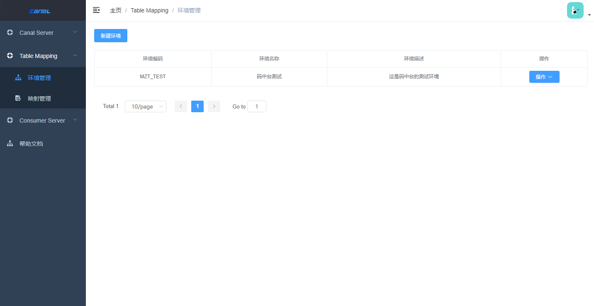
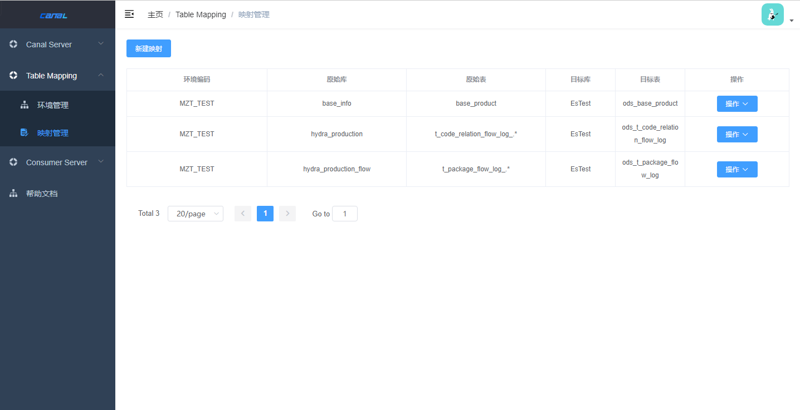
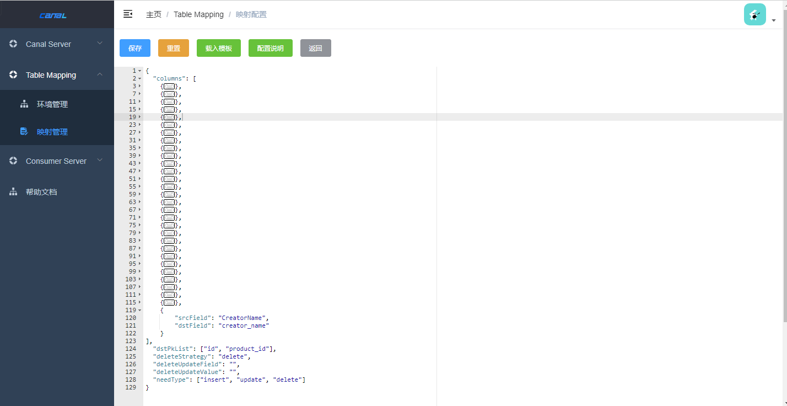

# 背景

业务中有多个数据分库分表，多个实例中存在同名数据库+同名表+自增主键id的数据。需要将其同步到一张StarRocks表中，需要保证数据一致。  
业务数据库的字段命名不规范，需要进行字段映射。

# 设计理念
新增一个配置，进行表级别的数据映射配置，同时解决上述的问题。

## 变化点
1. 新增Table-Mapping功能，其包括 环境管理 和 映射管理功能。  
 - 环境管理：用于标识一组映射管理，进行多环境的映射隔离。
 - 映射管理：进行表级别的字段映射，解决遇到的问题。

## 功能介绍
1. 环境管理
   
2. 映射管理
  

## 详细配置说明

1.columns: 原表与目标表直接的字段级映射。  
- A: srcField: 原表字段名称，除了支持原表的字段之外，还支持以下值：
      ${DATABASE_INSTANCE}: 表示当前的原表所在库的实例信息。  
      ${DATABASE_NAME}: 表示当前的原表的库名。  
      ${TABLE_NAME}: 表示当前的原表的表名。  
      ${SYNC_TIME}: 表示该条ddl的同步时间。  

- B: dstField: 目标表的字段名称

2.dstField: 目标表的主键字段，值为数组。

3.deleteStrategy: 针对删除数据的策略，支持的值为：delete、update

4.deleteUpdateField: 如何将删除策略配置为update，则需要指定更新的目标表字段名称。

5.deleteUpdateValue: 如何将删除策略配置为update，则需要指定更新的目标表字段值。

6.needType: 所需要的数据变更类型，值为数组，支持的值为：insert、update、delete。

